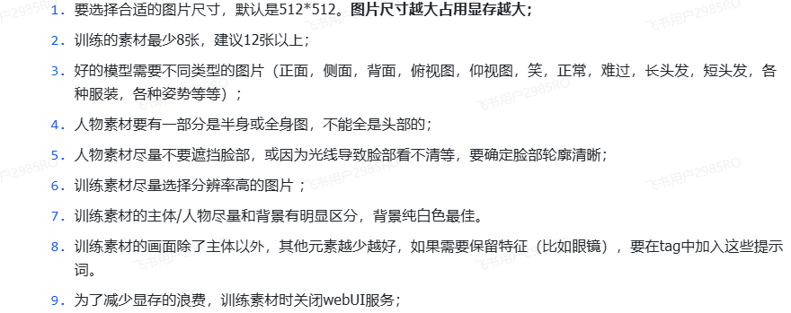
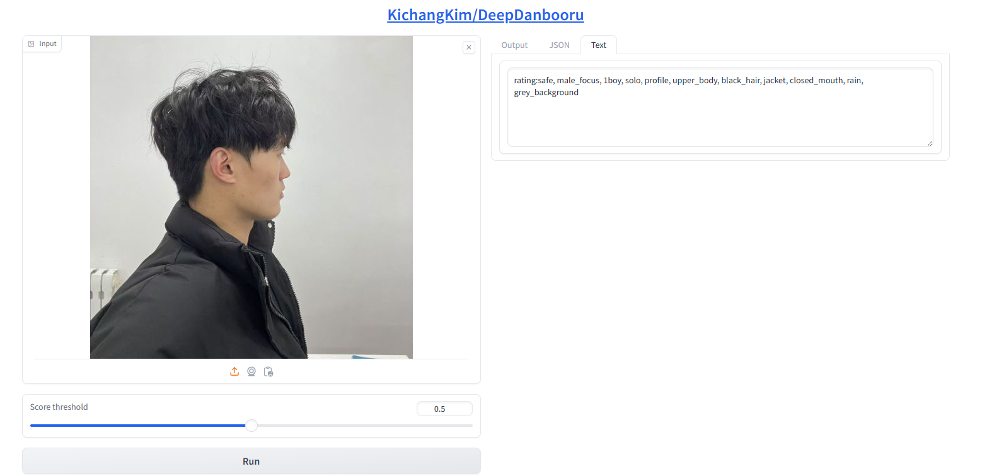
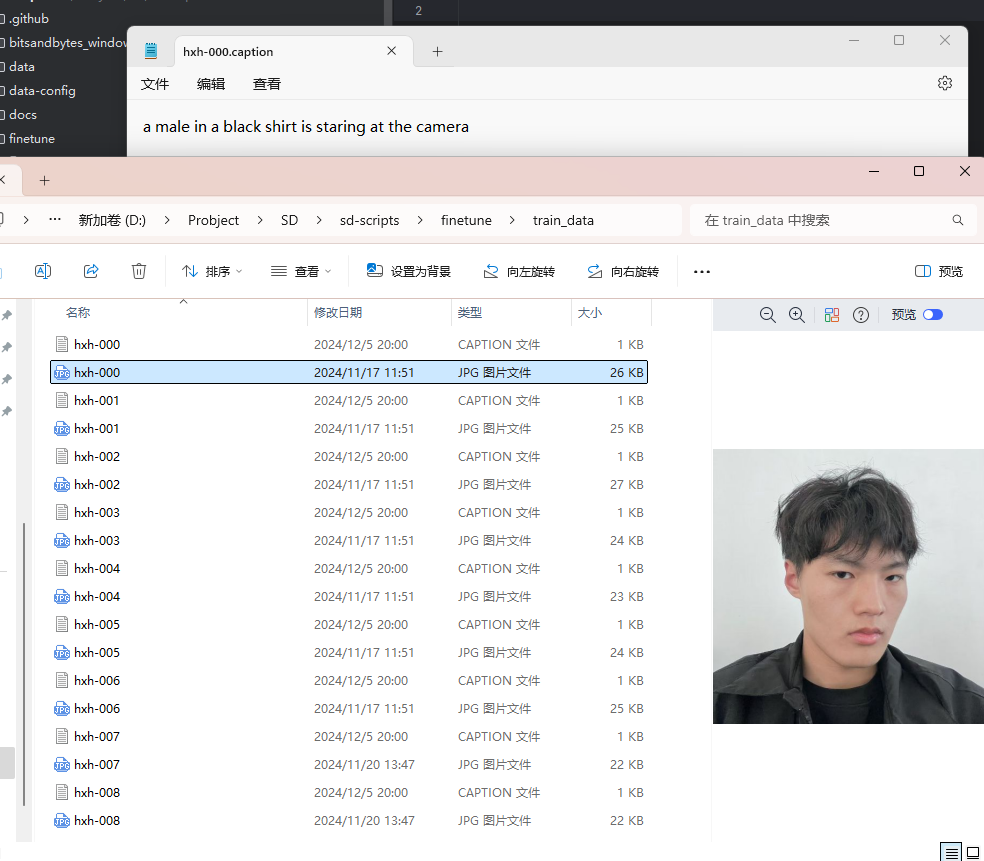
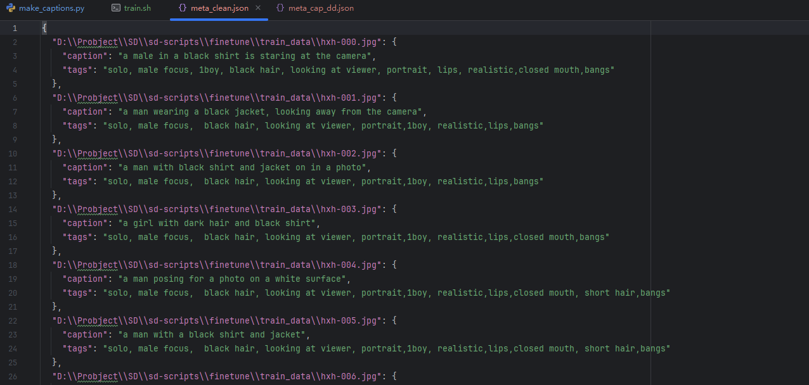

# LORA日记
## 环境安装
ps：根据自己的电脑安装合适的Ptorch版本，文件中并未列出
```
pip install -r requirement.txt
```
## 使用官方文档

[由 darkstorm2150 提供的英文翻译在此](https://github.com/darkstorm2150/sd-scripts#links-to-usage-documentation).

* [训练指南 - 常见](./docs/train_README-ja.md) : 数据描述，选项等...
  * [中文版本](./docs/train_README-zh.md)
* [SDXL 训练](./docs/train_SDXL-en.md) (英文版本)
* [数据集 config](./docs/config_README-ja.md) 
  * [英文版本](./docs/config_README-en.md)
* [DreamBooth 训练 指导](./docs/train_db_README-ja.md)
* [逐步微调指南](./docs/fine_tune_README_ja.md):
* [Lora 训练](./docs/train_network_README-ja.md)
* [训练文本反转](./docs/train_ti_README-ja.md)
* [图片生成](./docs/gen_img_README-ja.md)
* note.com [模型转换](https://note.com/kohya_ss/n/n374f316fe4ad)

## 数据收集
供参考：




* 图片裁剪：[Brime](https://www.birme.net/)
ps：如果想让图片画出来的更好看，可以先美颜！

数据集（经过裁剪后的512*512）


##打标
文档提供了3中方法-暂时操作了前2种方法
1.DreamBooth、class + identifier方式
2.DreamBooth，caption
3.fine tuning

##DreamBooth、class + identifier
优点：特定对象属于某个类别（如动物或人物）且具备唯一性
缺点：（1）不能选择性的保留图片的某些特征，难以捕捉复杂细节：标识符和类别信息有时可能不足以捕捉到特定对象的复杂细节或特征。例如，某些人物特征（如发型、眼睛颜色等）可能需要更多的视觉信息来准确描述。
（2）训练数据的所有元素（如发型、衣服和背景）都与标识符相关联并学习，因此可能无法在生成时的提示下更换衣服。
identifier数据集的配置
```
[general]
enable_bucket = true                        # 是否使用Aspect Ratio Bucketing

[[datasets]]
resolution = 512                            # 训练分辨率
batch_size = 8                              # 批次大小

  [[datasets.subsets]]
  image_dir = '/kaggle/input/hxh-dataset/lora-hxh/hxh'                   # 指定包含训练图像的文件夹
  class_tokens = 'hxh_boy'                # 指定标识符类
  num_repeats = 10                          # 训练图像的重复次数
```

##DreamBooth+caption
使用自然语言描述来指定目标对象或场景，更加灵活，个性化，定制化需求
缺点：生成内容受限于描述的质量，描述模糊时可能导致生成不符合预期的图像。
### 1.DeepDanbooru 
ps: 想要机器自动学习的特征-删除；想要自由控制的特征词-保留
模型链接：DeepDanbooru - a Hugging Face Space by hysts
ps：这里我没有按照文档里面的的方法使用，这里的deepdanbooru可以直接在网页端使用。
因为：我这里数据集少，所以没有使用标准方法进行批量处理。


特征词：male_focus, 1boy, solo, profile, upper_body,hair_ornament,black_hair


caption数据集配置：
```
[general]
enable_bucket = true                        # 是否使用Aspect Ratio Bucketing

[[datasets]]
resolution = 512                            # 训练分辨率
batch_size = 8                              # 批次大小

  [[datasets.subsets]]
  image_dir = '/kaggle/input/hxh-dataset/lora-hxh/hxh-caption'                # 指定包含训练图像的文件夹
  caption_extension = '.txt'            # 若使用txt文件,更改此项
  num_repeats = 10                          # 训练图像的重复次数
```

WD14Tagger（描述的更准确） 这里不做展示

### 2.BLIP
脚本
```
python make_captions.py --batch_size 4  "D:\Probject\SD\sd-scripts\finetune\train_data"
```



###  3.fine tuning

相当于将DeepDanbooru 和BLIP整合，一起使用
元数据（格式：.json）:caption和标签整合到管理文件中。
标签和caption预处理
将标签和caption放入元文件里
caption预处理
```
python merge_captions_to_metadata.py --full_path "D:\Probject\SD\sd-scripts\finetune\train_data"  meta_cap.json
```
标签预处理
```
python merge_dd_tags_to_metadata.py --full_path "D:\Probject\SD\sd-scripts\finetune\train_data" --in_json meta_cap.json meta_cap_dd.json
```

形成的元文件



数据集配置
```
[general]
shuffle_caption = true
keep_tokens = 1

[[datasets]]
resolution = 512                                    # 图像分辨率
batch_size = 4                                      # 批次大小

  [[datasets.subsets]]
  image_dir = '/kaggle/input/hxh-dataset/lora-hxh/hxh'                             # 指定包含训练图像的文件夹
  metadata_file = '/kaggle/input/hxh-dataset/lora-hxh/meta_clean'            # 元数据文件名

```

标题和标签清理
```
python clean_captions_and_tags.py meta_cap_dd.json meta_clean.json
```

ps：去掉一些符号，例如：‘-’


## 实验
### 1. 如何使用提示词

直接对提示词赋予权重：（提示词：权重）

(1girl:0.75)  权重为0.75

（1girl）权重乘以1.1

 {} 花括号：增加权重0.05
 
[]方括号:权重除以1.1

### 2. 连接符
and：将多个词缀聚合在一个提示词顺序位置中，其初始权重一致
bird and dog and pig 3个权重是一致的
#### 分布渲染
```
// 渲染蓝色到40%进度后，开始渲染红色
[blue:red:0.4]

// 前12步渲染蓝色后，开始渲染红色
[blue:red:12]
```

### 3.反向提示词
nsfw, paintings, cartoon, anime, sketches, worst quality, low quality, normal quality, lowres, watermark, monochrome, grayscale, ugly, blurry, Tan skin, dark skin, black skin, skin spots, skin blemishes, age spot, glans, disabled, distorted, bad anatomy, morbid, malformation, amputation, bad proportions, twins, missing body, fused body, extra head, poorly drawn face, bad eyes, deformed eye, unclear eyes, cross-eyed, long neck, malformed limbs, extra limbs, extra arms, missing arms, bad tongue, strange fingers, mutated hands, missing hands, poorly drawn hands, extra hands, fused hands, connected hand, bad hands, wrong fingers, missing fingers, extra fingers, 4 fingers, 3 fingers, deformed hands, extra legs, bad legs, many legs, more than two legs, bad feet, wrong feet, extra feets,

### 4. 正则化
降低过拟合都，提高泛化性

一：1.正则化的图片，固定一些信息；2.将偏离的lora给扳回来，也就是起到了限制lora肆意发展的能力

引导lora生成的预训练素材相似的图片

#### 目标：生成蓝色头发的我
步长：28
cfg：7


  


